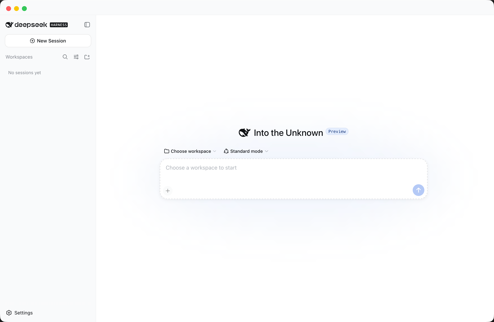

<div align="center">
  
  <h1>DeepSeek Harness Desktop</h1>
  <p>An unofficial, ready-to-use macOS, Windows, and Linux desktop wrapper for DeepSeek Harness.</p>
  <p>
    <strong>English</strong> · <a href="README.zh-CN.md">简体中文</a>
  </p>
  <p>
    <a href="https://github.com/huangj17/deepseek-harness-desktop/releases/latest"></a>
    <a href="LICENSE"></a>
    
    
    
  </p>
</div>

> [!IMPORTANT]
> This is an unofficial community project and is not affiliated with or endorsed by DeepSeek. DeepSeek Harness and its trademarks belong to their respective owners.

DeepSeek Harness Desktop packages the official [DeepSeek Harness](https://github.com/deepseek-ai/deepseek-harness) web experience into a self-contained Electron app. Users install the native package, launch the app, and start working without installing Node.js or running terminal commands.

## Preview

<p align="center">
  
</p>

## Highlights

- **Ready to install** — Node.js, the Harness runtime, and required dependencies are bundled in the app.
- **Official Harness UI** — the app launches the official local web interface rather than maintaining a separate frontend fork.
- **Local by default** — the Harness service listens on `127.0.0.1`; application data remains in the operating system's user data directory.
- **Runtime updates** — checks the official `@deepseek-ai/dsh` npm release after launch and every six hours, with validation and automatic fallback.
- **Client update checks** — checks the GitHub releases feed after launch and every six hours, opening the installer for your platform or letting you skip a version.
- **Bundled DSH terminal** — opens the system terminal at the current workspace with the active bundled or downloaded `dsh` runtime ready to use.
- **Close to background** — closing the main window keeps Harness and active tasks running; reopen it from the app icon, or use the Dock/taskbar/tray menu to quit fully.
- **Native desktop shell** — polished macOS title bar and traffic-light controls, a standard Windows system frame, and native Linux packages.
- **Upstream tracking** — the official source repository is kept as the `upstream` Git submodule and can be updated independently.

## Download and install

Choose the package for your system. These links download version **0.2.11** directly:

| System | Architecture | Package | Download |
| --- | --- | --- | --- |
| macOS | Apple Silicon | DMG | [Download](https://github.com/huangj17/deepseek-harness-desktop/releases/download/v0.2.11/DeepSeek-Harness-0.2.11-arm64.dmg) |
| macOS | Intel | DMG | [Download](https://github.com/huangj17/deepseek-harness-desktop/releases/download/v0.2.11/DeepSeek-Harness-0.2.11-x64.dmg) |
| Windows | x64 | Setup installer | [Download](https://github.com/huangj17/deepseek-harness-desktop/releases/download/v0.2.11/DeepSeek-Harness-0.2.11-x64.exe) |
| Windows | x64 | Portable ZIP | [Download](https://github.com/huangj17/deepseek-harness-desktop/releases/download/v0.2.11/DeepSeek-Harness-0.2.11-x64.zip) |
| Linux | x64 | AppImage | [Download](https://github.com/huangj17/deepseek-harness-desktop/releases/download/v0.2.11/DeepSeek-Harness-0.2.11-x64.AppImage) |
| Debian / Ubuntu | x64 | deb | [Download](https://github.com/huangj17/deepseek-harness-desktop/releases/download/v0.2.11/DeepSeek-Harness-0.2.11-x64.deb) |

[View all release files and SHA-256 checksums](https://github.com/huangj17/deepseek-harness-desktop/releases/tag/v0.2.11).

- **macOS:** open the DMG and drag **DeepSeek Harness** into **Applications**.
- **Windows installer:** run the EXE and follow its prompts. For the portable build, extract the ZIP and launch the app directly.
- **Linux AppImage:** mark the file as executable, then launch it. On Debian or Ubuntu, install the deb package with your software installer.

After installation, launch **DeepSeek Harness** and follow the in-app prompts to configure your DeepSeek API key and choose a workspace.
Use **Open DSH Terminal** at the bottom of the sidebar to open your system terminal in the current workspace. Its `dsh` command uses the same Harness home and runtime version as the desktop client; no global installation is required.

Current desktop release: **0.2.11**<br>
Bundled Harness release: **0.1.0-rc.6**

> [!NOTE]
> Current community builds are not backed by a commercial signing certificate. macOS builds are ad-hoc signed but not Apple-notarized, and Windows may display a Microsoft Defender SmartScreen warning. Only download installers from this repository's Releases page.

## How it works

```text
Electron main process
├── starts bundled @deepseek-ai/dsh on 127.0.0.1
├── opens the official Harness web UI in an isolated BrowserWindow
├── stores sessions and settings in the macOS user data directory
├── stops the local Harness process when the app exits
└── checks official npm releases for validated runtime updates
```

The Electron desktop version and the Harness runtime version are managed separately. Updating the runtime does not replace the Electron application. The bundled runtime always remains available as a fallback. Updating the desktop client itself means installing a freshly downloaded package over the current one.

## Repository layout

```text
.
├── desktop/                 Electron application and packaging code
├── upstream/                Official DeepSeek Harness Git submodule
├── README.md                English documentation (default)
├── README.zh-CN.md          Simplified Chinese documentation
├── AGENT.md                 Maintenance notes for coding agents
└── 更新官方源码.command       Double-click upstream update helper for macOS
```

## Build from source

### Requirements

- Apple Silicon or Intel Mac, Windows x64, or Linux x64 machine
- Node.js 24 or later
- npm
- Xcode Command Line Tools

### Build

```sh
git clone --recurse-submodules git@github.com:huangj17/deepseek-harness-desktop.git
cd deepseek-harness-desktop/desktop
npm ci
npm run check
```

Build on the target operating system:

```sh
# Apple Silicon macOS
npm run dist:mac:arm64

# Intel macOS
npm run dist:mac:x64

# Windows x64 installer and portable ZIP
npm run dist:win

# Linux x64 AppImage and deb
npm run dist:linux
```

Packages are generated in `desktop/dist/`. Tagged releases are built on native macOS, Windows, and Linux GitHub runners, smoke-tested, checksummed, and published automatically.

Useful verification commands:

```sh
npm run check
npm run smoke:runtime
npm run smoke:updater
npm run smoke:packaged
```

Some smoke tests open a local port or access the official npm registry and may require macOS permission or network access.

## Updating the official source

The `upstream/` directory tracks the official repository without modifying its remote or history.

```sh
git submodule update --init --remote --checkout upstream
```

On macOS, you can also double-click `更新官方源码.command`.

Source updates and in-app runtime updates are independent: `upstream/` follows Git commits, while the desktop app installs published `@deepseek-ai/dsh` versions from the official npm registry.

## Security and privacy

- The embedded web service binds to `127.0.0.1`, not a public network interface.
- API keys, logs, sessions, downloaded runtimes, and application data are excluded from this repository.
- External links open in the system browser instead of inside the privileged app window.
- The renderer uses context isolation, sandboxing, disabled Node integration, and web security.
- Runtime updates are accepted only from the official npm package name and are activated after installation checks.

Please report security issues according to [SECURITY.md](SECURITY.md).

## Contributing

Contributions and bug reports are welcome. Read [CONTRIBUTING.md](CONTRIBUTING.md) before opening a pull request.

Please keep changes to the desktop wrapper outside `upstream/`. Changes intended for DeepSeek Harness itself should be contributed to the [official repository](https://github.com/deepseek-ai/deepseek-harness).

## License

The Electron desktop wrapper is released under the [MIT License](LICENSE).

The `upstream/` submodule is a separate project and remains subject to its own license and third-party notices. DeepSeek names, logos, and trademarks are the property of their respective owners.
