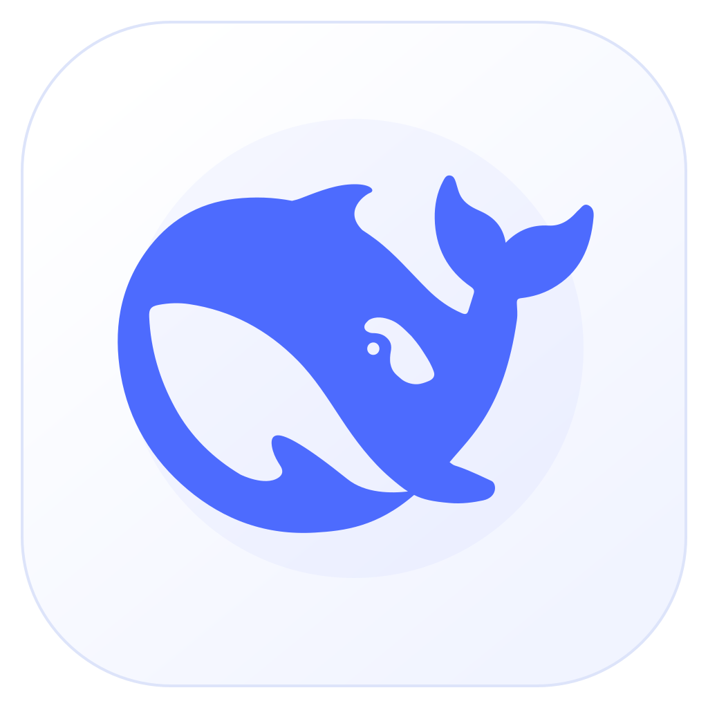
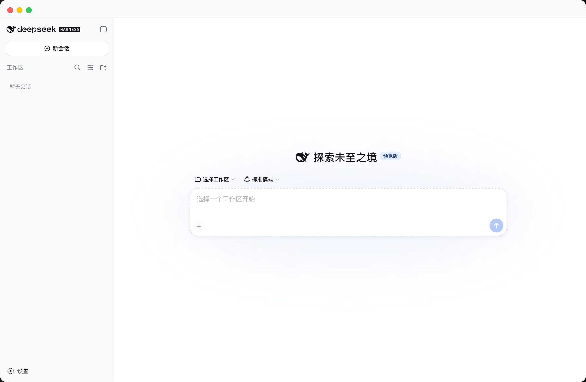

<div align="center">
  
  <h1>DeepSeek Harness Desktop</h1>
  <p>一个开箱即用的非官方 DeepSeek Harness macOS、Windows 与 Linux 桌面封装。</p>
  <p>
    <a href="README.md">English</a> · <strong>简体中文</strong>
  </p>
  <p>
    <a href="https://github.com/huangj17/deepseek-harness-desktop/releases/latest"></a>
    <a href="LICENSE"></a>
    
    
    
  </p>
</div>

> [!IMPORTANT]
> 这是一个非官方社区项目，与 DeepSeek 没有隶属或官方背书关系。DeepSeek Harness 及相关商标归各自权利人所有。

DeepSeek Harness Desktop 将官方 [DeepSeek Harness](https://github.com/deepseek-ai/deepseek-harness) Web 体验封装成一个自包含的 Electron 应用。用户只需安装对应系统的安装包并打开应用，无需另外安装 Node.js，也无需在终端中执行命令。

## 界面预览

<p align="center">
  
</p>

## 主要特性

- **下载安装即用**：应用内置 Node.js、Harness 运行时及所需依赖。
- **官方 Harness 界面**：直接启动官方本地 Web UI，不维护独立的前端分支。
- **本地优先**：Harness 服务仅监听 `127.0.0.1`，应用数据保存在操作系统的用户数据目录。
- **运行时更新**：启动后及每 6 小时检查官方 `@deepseek-ai/dsh` npm 版本，验证成功后启用，失败时自动回退。
- **原生桌面外壳**：macOS 提供独立标题栏、拖动区和原生红黄绿按钮；Windows 使用标准系统窗口；Linux 提供原生软件包。
- **官方源码同步**：官方源码作为 `upstream` Git 子模块保留，可与桌面客户端独立更新。

## 下载与安装

请选择对应系统的软件包。以下链接可直接下载 **0.2.8**：

| 系统 | 架构 | 软件包 | 下载 |
| --- | --- | --- | --- |
| macOS | Apple 芯片 | DMG | [直接下载](https://github.com/huangj17/deepseek-harness-desktop/releases/download/v0.2.8/DeepSeek-Harness-0.2.8-arm64.dmg) |
| macOS | Intel | DMG | [直接下载](https://github.com/huangj17/deepseek-harness-desktop/releases/download/v0.2.8/DeepSeek-Harness-0.2.8-x64.dmg) |
| Windows | x64 | 安装程序 | [直接下载](https://github.com/huangj17/deepseek-harness-desktop/releases/download/v0.2.8/DeepSeek-Harness-0.2.8-x64.exe) |
| Windows | x64 | 便携 ZIP | [直接下载](https://github.com/huangj17/deepseek-harness-desktop/releases/download/v0.2.8/DeepSeek-Harness-0.2.8-x64.zip) |
| Linux | x64 | AppImage | [直接下载](https://github.com/huangj17/deepseek-harness-desktop/releases/download/v0.2.8/DeepSeek-Harness-0.2.8-x64.AppImage) |
| Debian / Ubuntu | x64 | deb | [直接下载](https://github.com/huangj17/deepseek-harness-desktop/releases/download/v0.2.8/DeepSeek-Harness-0.2.8-x64.deb) |

[查看全部发布文件及 SHA-256 校验值](https://github.com/huangj17/deepseek-harness-desktop/releases/tag/v0.2.8)。

- **macOS**：打开 DMG，并将 **DeepSeek Harness** 拖入“应用程序”。
- **Windows 安装版**：运行 EXE 并按提示安装；便携版解压 ZIP 后即可直接启动。
- **Linux AppImage**：为文件添加可执行权限后启动；Debian 或 Ubuntu 用户也可以使用系统软件安装器打开 deb 包。

安装完成后，打开 **DeepSeek Harness**，按照应用内提示配置 DeepSeek API Key 并选择工作目录。

当前桌面客户端版本：**0.2.8**<br>
安装包内置 Harness 版本：**0.1.0-rc.6**

> [!NOTE]
> 当前社区构建没有商业代码签名证书。macOS 构建使用临时签名且尚未经过 Apple 公证，Windows 可能显示 Microsoft Defender SmartScreen 提示。请只从本仓库的 Releases 页面下载安装包。

## 工作原理

```text
Electron 主进程
├── 在 127.0.0.1 启动内置 @deepseek-ai/dsh
├── 在安全隔离的 BrowserWindow 中打开官方 Harness Web UI
├── 将会话和设置保存到 macOS 用户数据目录
├── 退出应用时停止本地 Harness 进程
└── 从官方 npm 发布渠道检查并验证运行时更新
```

Electron 客户端版本与 Harness 运行时版本分别管理。更新 Harness 运行时不会替换 Electron 应用，安装包内置版本始终保留为回退版本。

## 项目结构

```text
.
├── desktop/                 Electron 客户端与打包代码
├── upstream/                DeepSeek Harness 官方 Git 子模块
├── README.md                英文文档（默认）
├── README.zh-CN.md          简体中文文档
├── AGENT.md                 供开发 Agent 使用的维护说明
└── 更新官方源码.command       macOS 双击更新官方源码脚本
```

## 从源码构建

### 环境要求

- Apple 芯片或 Intel Mac、Windows x64 或 Linux x64 电脑
- Node.js 24 或更高版本
- npm
- Xcode Command Line Tools

### 构建步骤

```sh
git clone --recurse-submodules git@github.com:huangj17/deepseek-harness-desktop.git
cd deepseek-harness-desktop/desktop
npm ci
npm run check
```

在对应的目标系统上构建：

```sh
# Apple 芯片 macOS
npm run dist:mac:arm64

# Intel macOS
npm run dist:mac:x64

# Windows x64 安装程序与便携 ZIP
npm run dist:win

# Linux x64 AppImage 与 deb
npm run dist:linux
```

构建完成的软件包位于 `desktop/dist/`。带版本标签的发布会在 GitHub 原生 macOS、Windows 和 Linux 构建机上自动打包、冒烟测试、生成校验值并发布。

常用验证命令：

```sh
npm run check
npm run smoke:runtime
npm run smoke:updater
npm run smoke:packaged
```

部分冒烟测试会打开本地端口或访问官方 npm 仓库，可能需要 macOS 权限或网络访问。

## 更新官方源码

`upstream/` 目录跟踪官方仓库，不修改其远程地址和提交历史。

```sh
git submodule update --init --remote --checkout upstream
```

在 macOS 上也可以直接双击 `更新官方源码.command`。

源码同步与应用内运行时更新彼此独立：`upstream/` 跟踪 Git 提交，而桌面应用从官方 npm 仓库安装已发布的 `@deepseek-ai/dsh` 版本。

## 安全与隐私

- 内置 Web 服务只绑定 `127.0.0.1`，不会监听公共网络接口。
- API Key、日志、会话、下载的运行时和应用数据不会提交到本仓库。
- 外部链接会在系统浏览器中打开，而不是在应用的特权窗口内打开。
- Renderer 启用上下文隔离和沙箱，关闭 Node 集成，并保留 Web 安全策略。
- 运行时更新只接受官方 npm 包名，并在安装检查通过后才会启用。

安全问题请按照 [SECURITY.md](SECURITY.md) 中的方式报告。

## 参与贡献

欢迎提交问题和改进。在创建 Pull Request 前，请先阅读 [CONTRIBUTING.md](CONTRIBUTING.md)。

桌面封装的修改应位于 `upstream/` 之外。针对 DeepSeek Harness 本身的改动，请提交到[官方仓库](https://github.com/deepseek-ai/deepseek-harness)。

## 许可证

Electron 桌面封装基于 [MIT License](LICENSE) 开源。

`upstream/` 子模块是独立项目，继续遵循其自身许可证和第三方声明。DeepSeek 名称、Logo 和商标归各自权利人所有。
